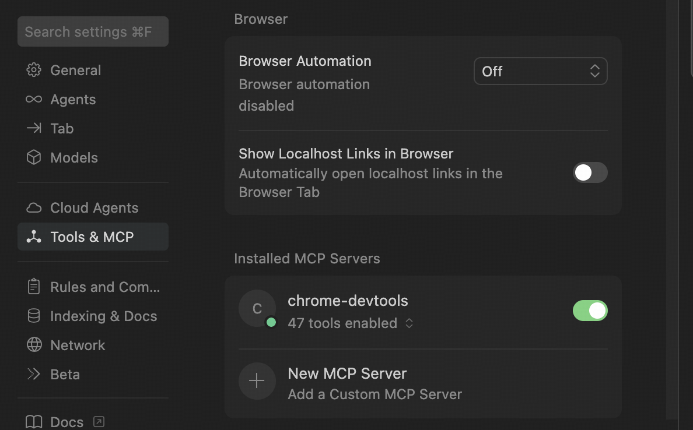
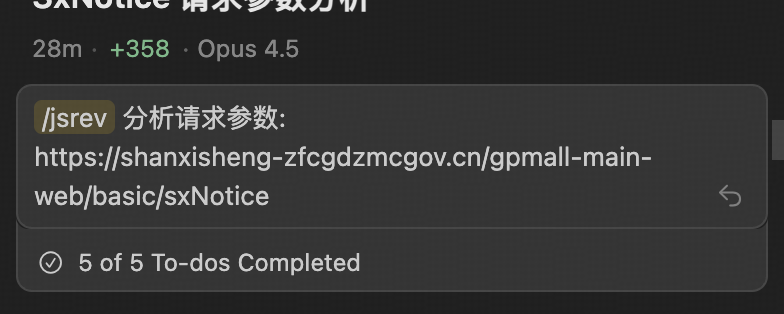

# Reverse AI Agent - 逆向 AI 助手

自动化分析网站 API 签名参数（如 `sign/sig/token/nonce/ts/enc`），从浏览器请求追踪到 JS 代码，最终生成 Python 复现脚本。

## 核心能力

| 分析阶段 | 能力 |
|---------|------|
| **请求捕获** | XHR/Fetch 流量拦截、调用栈追踪、多请求对比 |
| **参数定位** | 自动识别签名参数、追踪多步依赖链（init→token→sign） |
| **代码分析** | 断点调试、变量监控、函数 Probe、Grep 源码定位 |
| **算法提取** | 标准加密识别（MD5/SHA/AES/HMAC）、魔数检测、数据流跟踪 |
| **Python 复现** | 模块化代码生成、单元测试、浏览器-Python 交叉验证 |

## 支持场景

✅ **推荐使用**
- 标准签名算法（HMAC-SHA256、MD5、AES 等）
- 多步参数链（deviceId → sessionToken → sign）
- Cookie 生成逻辑追踪
- 混淆但可断点调试的 JS 代码

⚠️ **部分支持**（需人工辅助）
- JSVMP 字节码虚拟机（可追踪数据流，但需手动分析）
- WASM/WebWorker 内嵌算法

❌ **暂不支持**
- 验证码/滑块/登录墙（需手动完成）
- 二进制协议/Protobuf 签名

## 快速开始

### 1. 开启 chrome-devtools MCP

打开 Cursor Settings → **Tools & MCP** → 启用 `chrome-devtools`：



### 2. 使用命令

新建 Agent 对话，输入 `/jsrev` 命令 + 目标 URL：



```
/jsrev 分析请求参数: https://example.com/api/data
```

### 3. 输出产物

分析完成后，产物保存在 `artifacts/jsrev/<domain>/` 目录：

```
├── analysis_notes.md    # 分析笔记（可续传）
├── lib/                 # 核心算法模块
├── repro.py             # Python 复现脚本
├── test_crypto.py       # 验证测试
└── source/              # 保存的 JS 源码
```

## 推荐模型

| 优先级 | 模型 |
|--------|------|
| 最佳 | Claude Opus 4.5、Gemini 3 Pro |
| 次选 | Claude Sonnet 4.5、GPT 5.2 |

## 命令参数

| 参数 | 说明 | 默认值 |
|------|------|--------|
| `url` | 目标页面 URL | 必填 |
| `focus` | API 关键词过滤 | - |
| `goal` | `reverse`（完整逆向）/ `env`（环境重建） | `reverse` |

---

> 💡 **提示**：复杂混淆代码可参考 `js_deobfuscation_guide.md` 进行 AST 预处理
